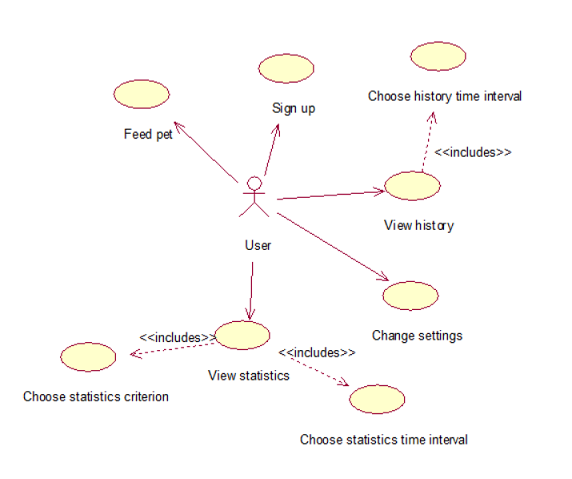
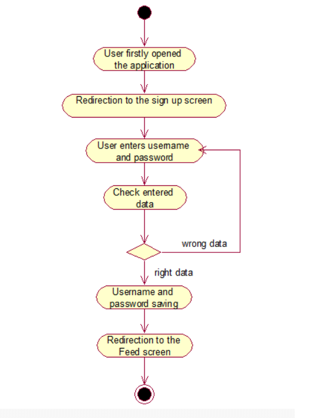
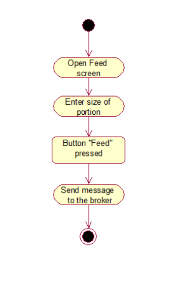
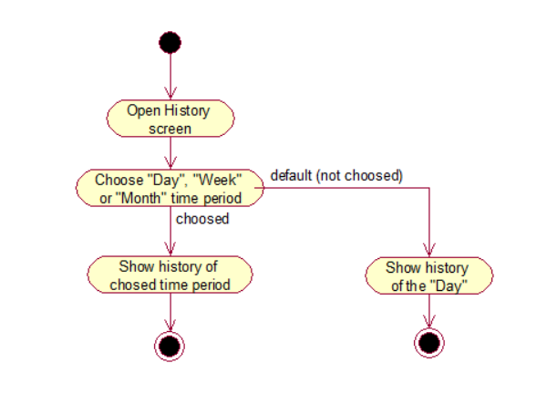
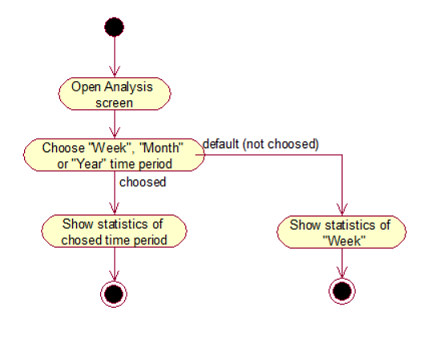
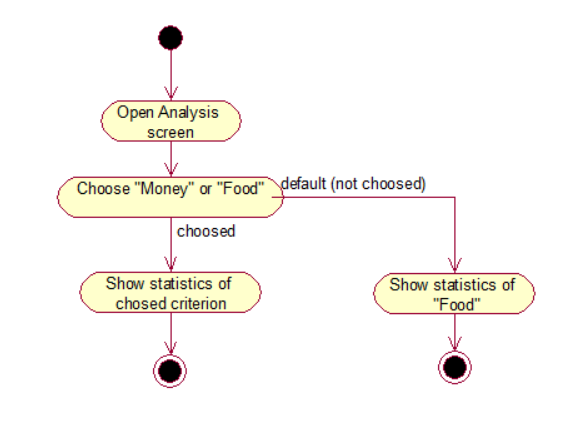
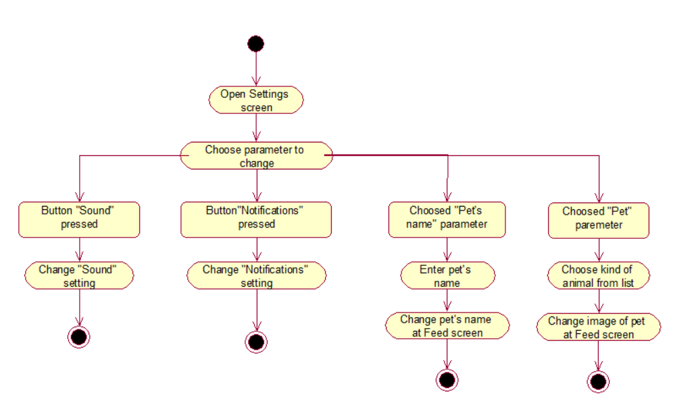
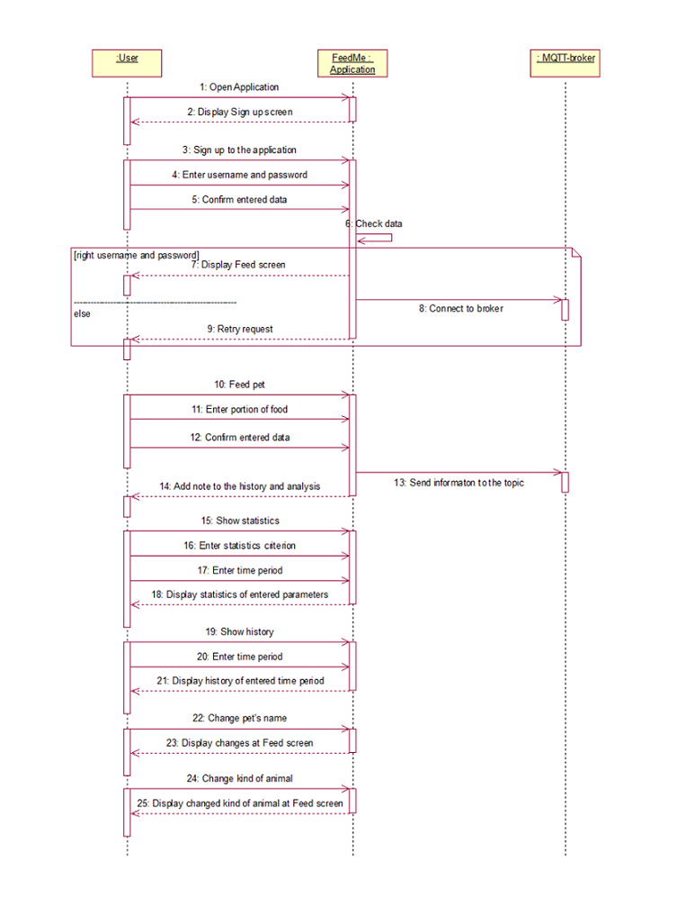
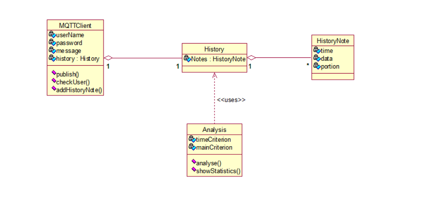
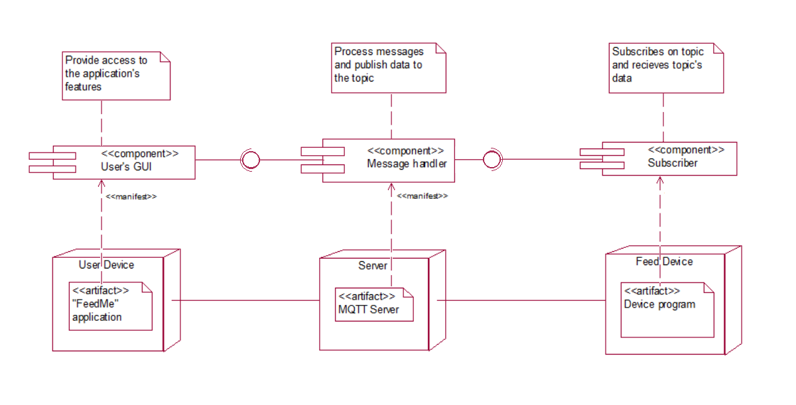

# System Design Specification
[Glossary](#0) 
1. [Use Case Diagram](#1) 
1.1. [Actors](#1.1) 
1.2. [Use Cases](#1.2) 
1.2.1 [Sign up](#1.2.1) 
1.2.2 [Feed pet](#1.2.2) 
1.2.3 [Choose history time interval](#1.2.3) 
1.2.4 [View history](#1.2.4) 
1.2.5 [Choose statistics time interval](#1.2.5) 
1.2.6 [Choose statistics criterion](#1.2.6) 
1.2.7 [View statistics](#1.2.7) 
1.2.8 [Change settings](#1.2.8) 
2. [Sequence Diagram](#2) 
3. [State Machine Diagram](#3) 
4. [Class Diagram](#4) 
5. [Component and Deployment Diagram](#5) 

## Glossary
- *Feed screen* is main screen of the application which provides an ability to feed 
pet and see general information about feeding and pet.
- *History screen* is the screen which shows information about feeding like time, data and portion of food.
- *Analysis screen* is the screen which shows statistics of spent money or food for chose period of time.
- *Settings screen* is the screen which shows main settings which user can change.
## 1. Use Case Diagram

### 1.1. Actors
|Actor|Description|
|:---|:---|
|User|A human who has device for feeding and use this application|
### 1.2. Use Cases
#### 1.2.1 Sign up
**Description:** Use Case "Sign up" allows a user to sign up to the application. 
**Preconditions:** A user opened the application for the first time. 
**Flow of events:** 
1. The application offers a user to enter username and password;
1. User should look at bought device and see username and password;
2. User must enter username and password;
3. User is registered if username and password are correct else user can't use this application;
4. End. 
#### Activity Diagram

#### 1.2.2 Feed pet
**Description:** Use Case "Feed pet" allows a user to choose portion of food and feed pet. 
**Flow of events:** 
1. A user open [Feed screen](#fs)
2. User must choose size of portion to feed;
3. User must push button "Feed";
4. The application connect to the broker and sends message about size of portion and feed command.
5. End.
#### Activity Diagram

#### 1.2.3 Choose history time interval
**Description:** Use Case "Choose history time interval" allows a user to choose time interval for history view. 
**Flow of events:** 
1. A user open [History screen](#hs).
2. User should choose one of the following periods of time: "Day", "Week", "Month";
3. If user will not choose period of time "Day" will be choosen as default.
4. End.
#### Activity Diagram

#### 1.2.4 View history
**Description:** Use Case "View history" allows a user to see information about feeding for chose time interval. 
**Preconditions:** Use Case "Choose history time interval" is performed. 
**Flow of events:** 
1. The application shows history of chose in Use Case "Choose history time interval" time interval. 
2. End.
#### 1.2.5 Choose statistics time interval
**Description:** Use Case "Choose statistics time interval" allows a user to choose time interval for statistics view. 
**Flow of events:** 
1. A user open [Analysis screen](#as).
2. User should choose one of the following periods of time: "Week", "Month", "Year";
3. If user will not choose period of time "Week" will be choosen as default.
4. End.
#### Activity Diagram

#### 1.2.6 Choose statistics criterion
**Description:** Use Case "Choose statistics criterion" allows a user to choose between spent money statistics or spent food statistics. 
**Flow of events:** 
1. A user open [Analysis screen](#as).
2. User should choose one of the following criterions: "Food", "Money";
3. If user will not choose criterion "Food" will be choosen as default.
4. End.
#### Activity Diagram

#### 1.2.7 View statistics
**Description:** Use Case "View statistics" allows a user to see analyzed information about feeding or 
spent money for chose time interval. 
**Preconditions:** Use Cases "Choose statistics time interval" and "Choose statistics criterion" is performed. 
**Flow of events:** 
1. The application shows statistics for criterion chose in Use Case "Choose statistics criterion"
for time interval chose in Use Case "Choose history time interval" . 
2. End.
#### 1.2.8 Change settings
**Description:** Use Case "Change settings" allows a user to change main settings like turn on/off notifications, sound, auto mode 
and change kind of animal and pet's name. 
**Flow of events:** 
1. A user should open [Settings screen](#ss). 
2. User should choose parameter which she/he want to change.
3. If user choose parameter "Sound"("Notification","Auto mode") then step 4, if "Pet's name" parameter
then alternative flow A1, if "Pet" parameter then alternative flow A2. 
4. To change parameter user should push on button near "Sound" ("Notification","Auto mode") parameter.
5. End. 
**Alternative flow A1:**
1. To change parameter "Pet's name" user should push on "Pet's name" line.
2. The application will offer user to enter pet's name.
3. The application will change pet's name on [Feed screen](#fs).
4. End. 
**Alternative flow A2:**
1. To change parameter "Pet" user should push on "Pet" line.
2. The application will offer user to choose from a list of kind of animals.
3. The application will change pet's image on [Feed screen](#fs).
4. End. 
#### Activity Diagram

## 2. Sequence Diagram

## 3. State Machine Diagram

## 4. Class Diagram

## 5. Component and Deployment Diagram

