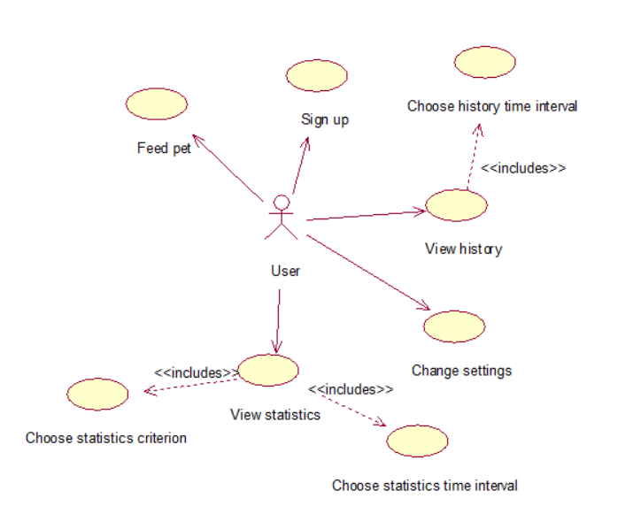

# System Design Specification

## Glossary
- *Feed screen* is main screen of the application which provides an ability to feed 
pet and see general information about feeding and pet.
- *History screen* is the screen which shows information about feeding like time, data and portion of food.
- *Analysis screen* is the screen which shows statistics of spent money or food for chose period of time.
## 1. Use Case Diagram

### 1.1. Actors
|Actor|Description|
|:---|:---|
|User|A human who has device for feeding and use this application|
### 1.2. Use Cases
#### 1.2.1 Sign up
**Description:** Use Case "Sign up" allows a user to sign up to the application. 
**Preconditions:** A user opened the application for the first time. 
**Flow of events:** 
1. The application offers a user to enter username and password;
1. User should look at bought device and see username and password;
2. User must enter username and password;
3. User is registered if username and password are correct else user can't use this application;
4. End. 
#### 1.2.2 Feed pet
**Description:** Use Case "Feed pet" allows a user to choose portion of food and feed pet. 
**Flow of events:** 
1. A user open [Feed screen](#fs)
2. User must choose size of portion to feed;
3. User must push button "Feed";
4. The application connect to the broker and sends message about size of portion and feed command.
5. End.
#### 1.2.3 Choose history time interval
**Description:** Use Case "Choose history time interval" allows a user to choose time interval for history view. 
**Flow of events:** 
1. A user open [History screen](#hs).
2. User should choose one of the following periods of time: "Day", "Week", "Month";
3. If user will not choose period of time "Day" will be choosen as default.
4. End.
#### 1.2.4 View history
**Description:** Use Case "View history" allows a user to see information about feeding for chose time interval. 
**Preconditions:** Use Case "Choose history time interval" is performed. 
**Flow of events:** 
1. The application shows history of chose in Use Case "Choose history time interval" time interval. 
2. End.
#### 1.2.5 Choose statistics time interval
**Description:** Use Case "Choose statistics time interval" allows a user to choose time interval for statistics view. 
**Flow of events:** 
1. A user open [Analysis screen](#as).
2. User should choose one of the following periods of time: "Week", "Month", "Year";
3. If user will not choose period of time "Week" will be choosen as default.
4. End.
#### 1.2.6 Choose statistics criterion
**Description:** Use Case "Choose statistics criterion" allows a user to choose between spent money statistics or spent food statistics. 
**Flow of events:** 
1. A user open [Analysis screen](#as).
2. User should choose one of the following criterions: "Food", "Money";
3. If user will not choose criterion "Food" will be choosen as default.
4. End.
#### 1.2.7 View statistics
**Description:** Use Case "View statistics" allows a user to see analyzed information about feeding or 
spent money for chose time interval. 
**Preconditions:** Use Cases "Choose statistics time interval" and "Choose statistics criterion" is performed. 
**Flow of events:** 
1. The application shows statistics for criterion chose in Use Case "Choose statistics criterion"
for time interval chose in Use Case "Choose history time interval" . 
2. End.
#### 1.2.8 Change settings
