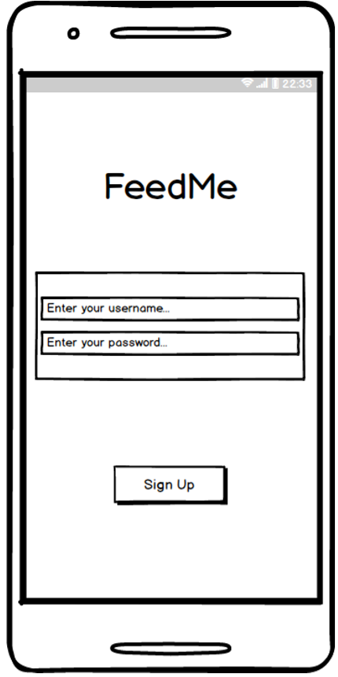
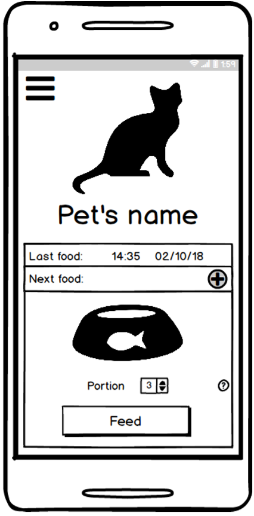
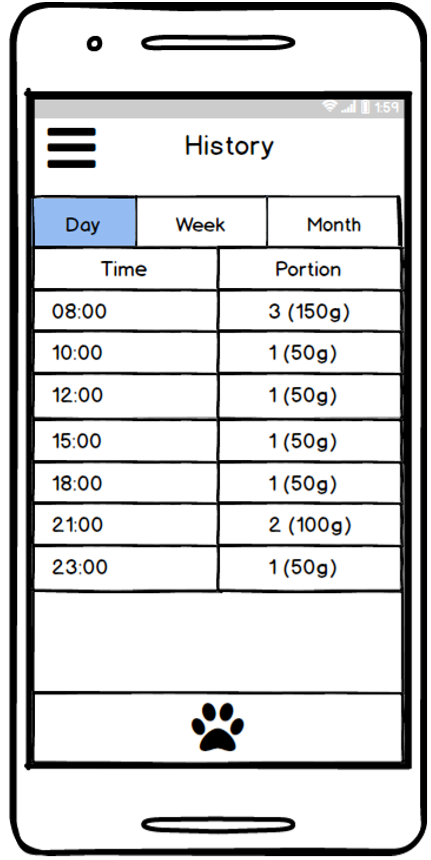
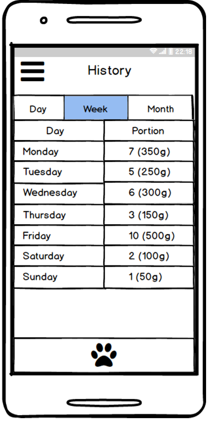
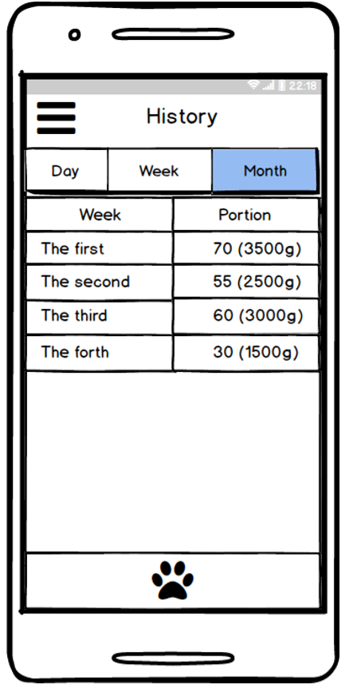

# Software Requirements Specification
---
[Glossary](#0) 
1. [Introduction](#1) 
1.1. [Purpose](#1.1) 
1.2. [Scope](#1.2) 
1.3. [Business Requirements](#1.3) 
1.3.1. [Initial Data](#1.3.1) 
1.3.2. [Business opportunities](#1.3.2) 
1.4. [Analogues](#1.4) 
2. [User Requirements](#2) 
2.1. [Software Interfaces](#2.1) 
2.2. [User Interfaces](#2.2) 
2.3. [User Characteristics](#2.3) 
2.3.1. [Target Audience](#2.3.1) 
2.3.2. [Required Experience](#2.3.2) 
2.4. [Assumptions and Dependencies](#2.4) 
3. [System Requirements](#3) 
3.1. [Functional Requrements](#3.1) 
3.1.1. [Sign-up](#3.1.1) 
3.1.2. [Settings](#3.1.2) 
3.1.3. [Feeding](#3.1.3) 
3.1.4. [History](#3.1.4) 
3.1.5. [Analysis](#3.1.5) 
3.2. [Non-Functional Requierements](#3.2) 
3.2.1. [Software Quality Attributes](#3.2.1) 
3.2.1.1. [Usability](#3.2.1.1) 
3.2.1.2. [Security](#3.2.1.2) 
3.2.2. [External Interfaces](#3.2.2) 
3.2.3. [Constraints](#3.2.3) 

## Glossary
In this section is described special terms used in SRS document.
- *MQTT protocol* is a simplified network protocol running over TCP/IP. Used to exchange messages on a publisher-subscriber basis.
- *MQTT-broker* is a server which is using MQTT protocol to message exchanging between two machines. For example between sensor and computer. 
- *Device* represents a board with Internet access, connected feeding mechanism and other sensors. *Device* is provided by customer.
- *History* means history of feeding.
- *Analysis* means graphic display of history in time.
## 1 Introduction 
### 1.1 Purpose 
  This document is written by business analyst and is intended for software developers , managers and customers to formalize and understand product requirement.
Developers use SRS to carry out tasks according to requirements. Managers use it to monitor progress of the project and to allocate tasks.
Customers should approve this document for futher check of fulfillment of the requirements.
### 1.2 Scope
  Developing application is named as **FeedMe.** It provides an ability to feed pet throught the Internet using mobile phone (Android).
  This application is designed for real device which based at user's home and connected to the Internet. 
### 1.3 Business Requirements
#### 1.3.1 Initial Data
Nowadays people want to have an ability to control some their devices when they are away from home. Pet's owners often face with problem when they have no opportunity to feed their pet. Different circumstance can be reason of this problem. 
#### 1.3.2 Business opportunities
- 1 This application allows people to feed their pet using mobile phone connected to the Internet and device for feeding. 
- 2 Look through the history of feeding and money spent on food. 
### 1.4 Analogues
Main functional possibilities depends on used device. Different devices has different set of sensors. This is the main difference between applications designed for specific device. Analogues: 
- [PetTec](https://play.google.com/store/apps/details?id=cn.xlink.pettec)
  - Device has weight sensor therefore application can monitor amount of remaining feed.
- [FunPaw Pet Feeder](https://play.google.com/store/apps/details?id=com.jyd.hk)
  - Device has a camera therefore application can broadcast live video of feeding and make snapshots.
  - Device has a dymanic therefore application can send voice messages while feeding.
- [JemPet](https://play.google.com/store/apps/details?id=com.jyd.hk)
  - Device has a camera therefore application can broadcast live video of feeding.
  
## 2 User Requirements
### 2.1 Software Interfaces
  **FeedMe** is dependent component of the system. The application should be able to control device which is based at user's home. 
  Control should be carried out through the MQTT-broker. 
  - In this application MQTT-broker is a [Cloud MQTT](https://www.cloudmqtt.com/) - hosted message broker for the Internet of Things.
  MQTT-brokers is provided by a customer.
  - **FeedMe** is an application installed on user's phone that provides control. Application will send requests to the MQTT-broker. Broker will send this request to the device and device will execute request.
  - The device represents a board with Internet access and connected feeding mechanism. Device is provided by a customer.
   
   Diagram of the system. 
For more information click [here](https://github.com/MaryBurshtyn/FeedMe/master/Documentation/diagram.png)
### 2.2 User Interfaces
|Sign-up screen|Screen of the first enterance|Feeding screen|Screen that shows menu bar|
|:---|:---|:---|:---|
|||||

|Settings screen|Day history screen|Week history screen|Month history screen|Analysis screen|
|:---|:---|:---|:---|:---|
||||||

### 2.3 User Characteristics
#### 2.3.1 Target Audience
People who bought device and want to have an ability to feed their pet being away from home. Mostly they are pet owners.
#### 2.3.2 Required Experience
To use **FeedMe** application users should have some base experience in using Android smartphone like connecting phone to the Internet, 
downloading application from Play Market.
### 2.4 Assumptions and Dependencies
- Application can't feed pet without phone connected to the Internet.
- Application can look through the history of feeding, spent food, changings of pet weight.
- Application can't feed pet manually without device connected to the Internet. 
- Application can't feed pet without working MQTT-broker.
## 3 System Requirements
### 3.1 Functional Requrements
#### 3.1.1 Sign-up
This section describes user sign-up to the application. User should be able to register if he/she is new to the application. Sign-up screen is the first screens displayed after the application is launched. Once login is a success, the system should keep the user logged in.

|Function|Requirement|
|:---|:---|
|Sign up|The application should allow the user to sign up by receiving Username and password.|
#### 3.1.2 Settings
This section describes set of settings that is provided by application.

|Function|Requirement|
|:---|:---|
|Choose pet|The application should allow the user to choose pet.|
|Name pet|The application should allow the user to name her/his pet by receiving pet's name.|
|Turn on/off notifications|The application should allow the user to turn on/off notifications.|
|Sound on/off|The application should allow the user to turn on/off sound.|
|Turn on/off auto mode|The application should allow the user to turn on/off auto mode.|

#### 3.1.3 Feeding
This section describes set of main functions provided by application.

|Function|Requirement|
|:---|:---|
|Feed|The application should allow the user to feed pet by using "feed" button.|
|Choose portion|The application should allow the user to choose size of portion to feed by using "portion" comboBox|
|Auto mode|The application should allow the user to feed pet automatically by turning on auto mode in settings and setting up time of feeding|     
|Add next food|The application should allow the user to add next time of feeding to show notification at set time or to feed automatically if auto mode is turned on.| 
|Show last food|The application should allow the user to see previous time of feeding by displaying at the screen.|

#### 3.1.4 History
This section describes history screen functions.

|Function|Requirement|
|:---|:---|
|Choose time interval|The application should allow the user to choose time interval to display history of specific period of time. It is provided by "Day", "Week", "Month" buttons.|
|Show history| The application should allow the user to see time and portion of feeding of current day.|
|| The application should allow the user to see day of the week and portion of feeding of current week.|
|| The application should allow the user to see week of the month and portion of feeding of current month.|
||The application should allow the user to see previous time of feeding by displaying at the screen.|
#### 3.1.5 Analysis
This section describes analysis screen functions.

|Function|Requirement|
|:---|:---|
|Choose time interval|The application should allow the user to choose time interval to display statistics of specific period of time. It is provides by  "Week", "Month","Year" buttons.|
|Show food statistics|The application should allow the user to see statistics of spent food. It is provided by  "Food" button.|
|Show money statistics|The application should allow the user to see statistics of spent money. It is provided by  "Money" button.|
### 3.2. Non-Functional Requierements
#### 3.2.1. Software Quality Attributes
##### 3.2.1.1 Usability
- Main function of application is feeding that's why button "Feed" will be contrast and will be differ from other elements.
- All functional elements of the user interface will have names describing the action that the element does.
- Principle of least effort: to feed pet user should do only 3 steps: 
  - 1 Open application
  - 2 Choose portion
  - 3 Push "feed" button
##### 3.2.1.2 Security
Unique username and password will be written on the case of device.
#### 3.2.2. External Interfaces
- The application will support portrait orientation only.
- Using principle "Form follows function": icons of elements will be dictated by their function.
#### 3.2.3. Constraints
- Application will not work without device for feeding.
- Main function "Feed" will not be able without Internet connection.

